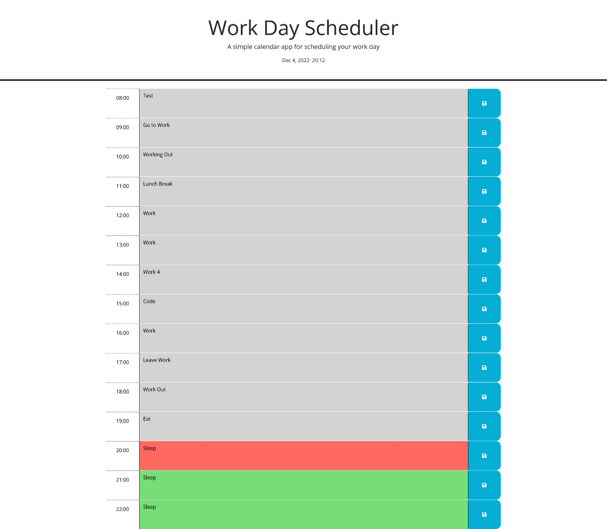

# Work-Day-Scheduler 05 Third-Party APIs: Work Day Scheduler
Work hours scheduler on browser mape in JS

[Link to Site](https://masonmarc.github.io/Work-Day-Scheduler/)

[Link to Github Repo](https://github.com/MasonMarc/Work-Day-Scheduler)

# Table of Contents

[Descriptions](#descriptions)

[Visuals](#visuals)

[Resources](#resources)

# Descriptions

This project is a Scheduler that you can use to type in tasks at a certain hour and save them so that the tasks will always populate using local storage.

# Visuals

# Resources

[Jquery](https://jquery.com/)

[Jquery](https://learningjquery.com/)

[Dayjs](https://day.js.org/en/)
